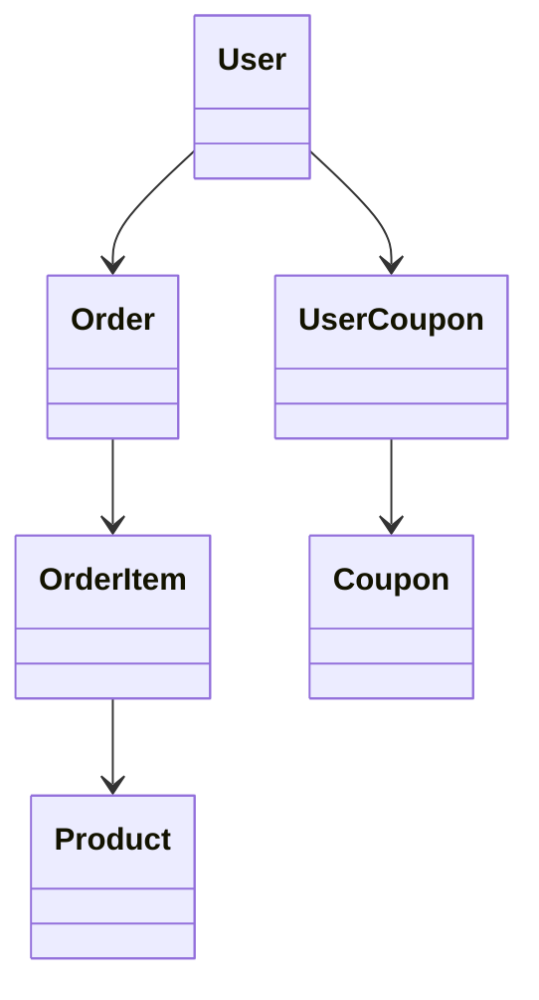

# 📄 클래스 다이어그램 문서

## ✅ 개요

본 문서는 도메인 모델을 기반으로 한 주요 클래스들의 구조 및 관계를 나타냅니다. **비즈니스 로직을 표현하는 도메인 클래스**와 그들 사이의 연관관계를 정의하고, 이후의 코드 설계 기준을 마련합니다.

---

## 📌 주요 클래스 목록

### 1. `User`

-   id: number
-   name: string
-   balance: number
-   +charge(amount: number): void

### 2. `Product`

-   id: number
-   name: string
-   price: number
-   stock: number
-   +decreaseStock(quantity: number): void

### 3. `Order`

-   id: number
-   user: User
-   items: OrderItem\[]
-   totalPrice: number
-   discountedPrice: number
-   createdAt: Date
-   +calculateTotal(): number

### 4. `OrderItem`

-   id: number
-   order: Order
-   product: Product
-   quantity: number
-   unitPrice: number
-   +subtotal(): number

### 5. `Coupon`

-   id: number
-   name: string
-   discountAmount: number
-   totalQuantity: number
-   issuedCount: number
-   +canIssue(): boolean

### 6. `UserCoupon`

-   id: number
-   user: User
-   coupon: Coupon
-   isUsed: boolean
-   issuedAt: Date
-   usedAt: Date (nullable)
-   +markUsed(): void

---

## 📌 클래스 간 관계

---

## 📌 요약

-   **집계 루트(Aggregate Root):** User, Product, Order
-   **OrderItem** 은 `Order`에 종속되는 내부 엔티티로 처리
-   **도메인 메서드** (`charge`, `decreaseStock`, `markUsed`)는 상태 변이를 명시적으로 처리

---

## 참고 문서

-   [ERD 및 모델링 문서](./02-erd.md)
-   [상태 다이어그램 문서](./05-state.md)
